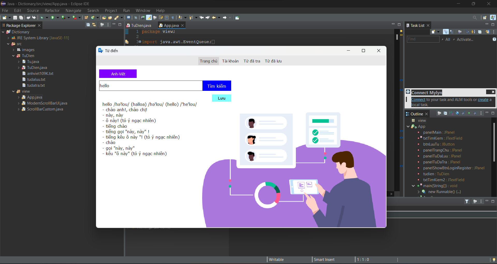
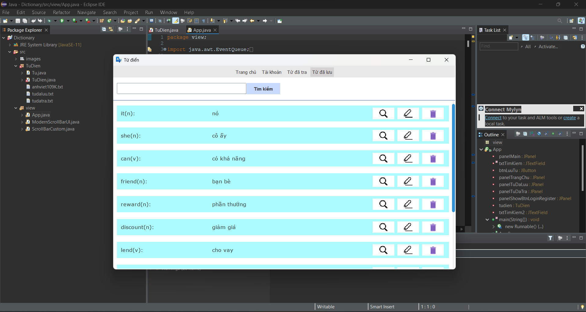
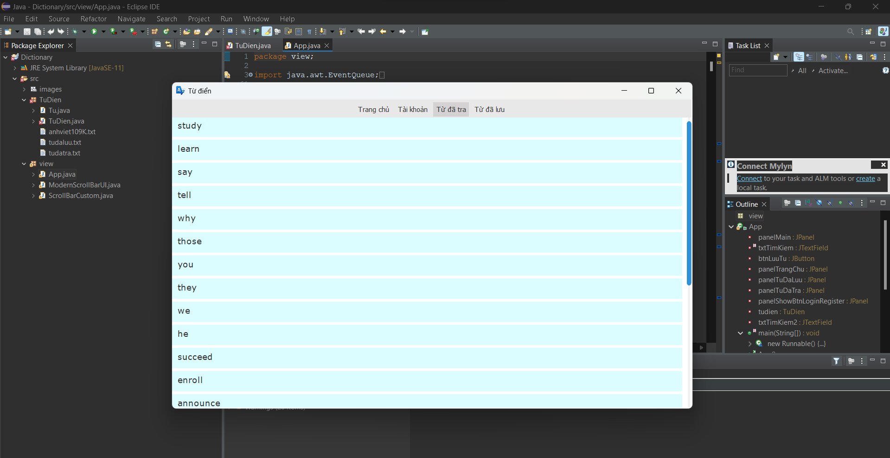

# QUẢN LÝ TỰ ĐIỂN BẰNG BẢNG BĂM KẾT HỢP VỚI FILE LƯU TRỮ DỮ LIỆU
- Công nghệ: java swing
- Sử dụng bảng băng mở để lưu từ điển với hơn 65.000 từ, sử dụng bảng băm mở để giúp việc tìm kiếm hiệu quả và nhanh hơn.

### Giao diện chính

### Giao diện từ đã lưu

### Giao diện từ đã tra
